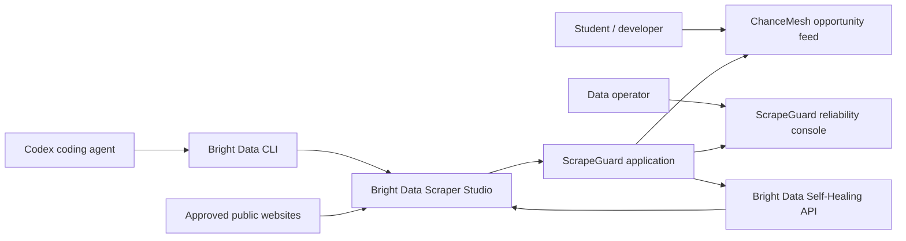
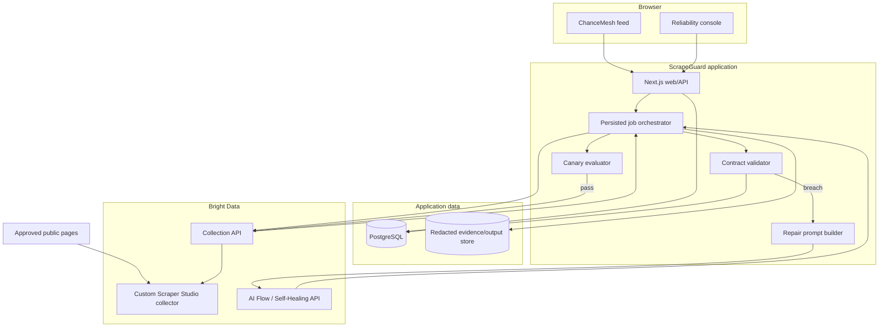
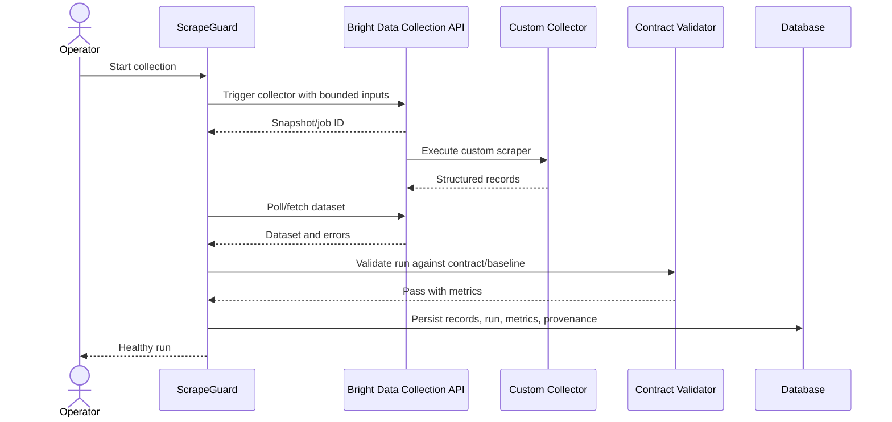
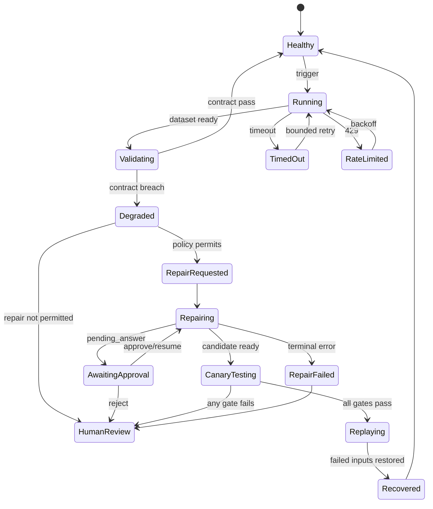
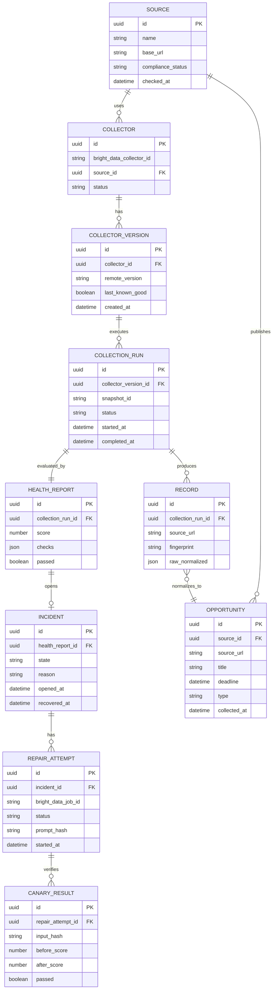
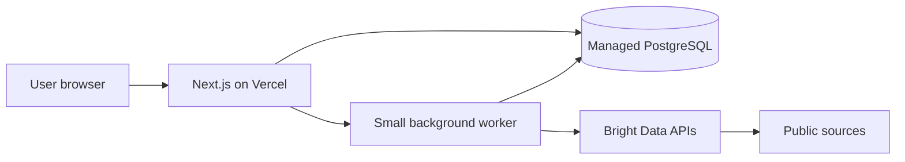
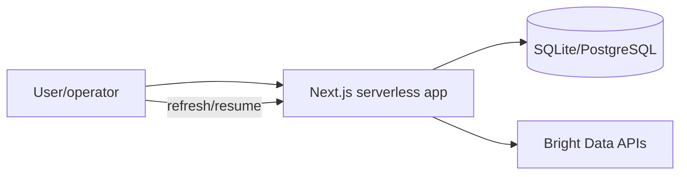
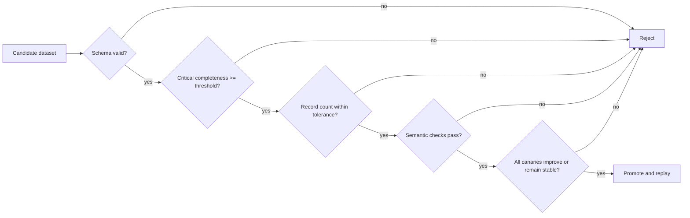

# ScrapeGuard Architecture Plan

Status: pre-event architecture and diagrams only. Implementation begins after the official start.

## 1. System context



The opportunity feed proves downstream value. The reliability console proves why Bright Data's custom collector and Self-Healing are central.

## 2. Container architecture



## 3. Golden collection sequence



## 4. Break-to-heal sequence

```mermaid
sequenceDiagram
    participant S as Source site
    participant C as Bright Data collector
    participant A as ScrapeGuard
    participant V as Validator
    participant H as Self-Healing API
    participant O as Operator

    S-->>C: Layout B with moved deadline field
    C-->>A: Records with missing deadline
    A->>V: Validate output
    V-->>A: Critical completeness regression
    A->>A: Open incident and preserve last-known-good data
    A->>H: Trigger refactor with field-level evidence
    loop asynchronous progress
        A->>H: Poll progress
        H-->>A: running / pending_answer / done
    end
    alt approval requested
        A-->>O: Show proposed diff and evidence
        O->>A: Approve or reject
        A->>H: Resume decision
    end
    A->>C: Run repaired collector on canaries
    C-->>A: Candidate output
    A->>V: Compare candidate with contract and baseline
    alt canaries pass
        V-->>A: Safe to promote
        A->>C: Replay failed inputs
        A-->>O: Recovered with audit trail
    else canaries fail
        V-->>A: Reject repair
        A-->>O: Human review; last-known-good remains active
    end
```

## 5. Repair state machine



## 6. Data model



## 7. Deployment options

### Preferred



Use when Self-Healing polling and replay exceed normal request duration.

### Simplified fallback



Use persisted state and operator-triggered progress checks. This is acceptable for a hackathon if the whole recovery loop remains genuine and auditable.

## 8. Module boundaries

| Module | Owns | Must not own |
|---|---|---|
| Bright Data client | Authenticated API calls, response mapping, backoff | Business validation thresholds |
| Run orchestrator | Idempotent workflow transitions | HTML extraction logic |
| Contract validator | Deterministic checks and score | API polling |
| Repair policy | Whether/when to heal and approve | Rendering UI |
| Prompt builder | Concise evidence-based prompt | Deciding that output is correct |
| Repository layer | Persistence and transactions | HTTP calls |
| Feed service | Querying trusted opportunity records | Triggering repairs |
| UI | Status, evidence, actions | Hidden workflow state |

## 9. Validation gates



No LLM score can bypass these gates.

## 10. Security boundaries

- API tokens stay server-side and are read from environment variables.
- Logs store masked IDs/tokens; UI receives only safe identifiers.
- Public source HTML is untrusted input.
- Extracted text is data, never executable prompt instructions.
- Repair prompts are built from bounded fields and sanitized evidence.
- Never expose arbitrary target URL execution to unauthenticated users in the MVP.
- Allowlist approved domains and cap inputs/page loads.
- Store prompt hashes and redacted prompts for audit, not secrets.
- Apply server-side authorization to repair approval actions if authentication is added.

## 11. Observability

Minimum structured events:

- `collection.triggered`
- `collection.completed`
- `collection.failed`
- `validation.completed`
- `incident.opened`
- `repair.triggered`
- `repair.progressed`
- `repair.awaiting_approval`
- `canary.completed`
- `repair.rejected`
- `replay.completed`
- `incident.recovered`

Every event includes correlation ID, source ID, safe collector ID, snapshot/job ID where applicable, state, duration, and reason.

## 12. Architecture acceptance criteria

- Bright Data is required for the golden path.
- Last-known-good data survives a failed run.
- Repeated webhook/poll responses do not duplicate records or transitions.
- A repair cannot auto-promote without deterministic canaries.
- All external calls have timeout, retry/backoff policy, and structured errors.
- The demo can recover after refresh/restart because workflow state is persisted.
- Every displayed opportunity retains source URL and collection provenance.
