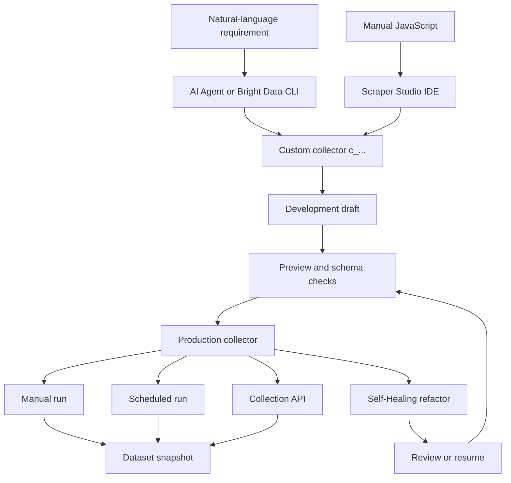
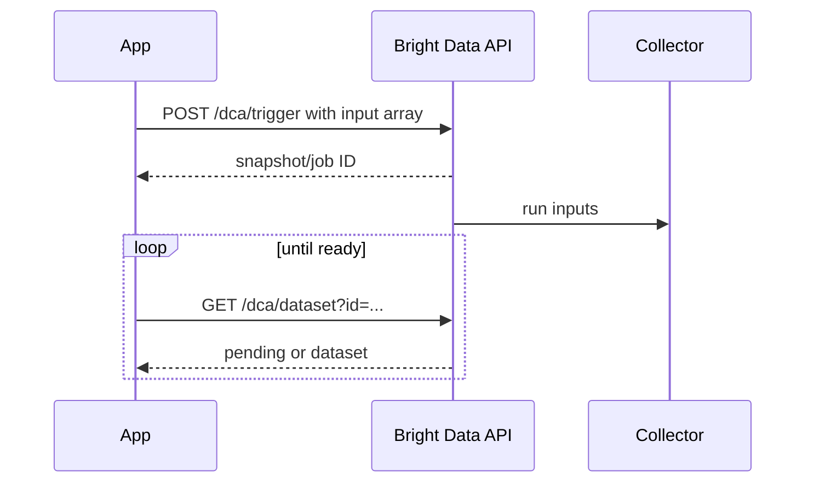

# Bright Data Scraper Studio Learning Guide

Purpose: learn the sponsor platform deeply before the event without implementing the competition project.

Do not reuse a pre-event practice collector, its generated code, or its output in the submission. Create the competition collector only after the official start.

## 1. Mental model

Bright Data Scraper Studio is a cloud environment for custom scrapers. It separates four concerns:

1. **Input contract** - values a run accepts, such as URL, keyword, country, or date.
2. **Interaction code** - reaches the target data by navigating, requesting, clicking, scrolling, waiting, or queuing another stage.
3. **Parser code** - turns HTML or captured responses into structured fields.
4. **Output contract** - field names, types, validation, defaults, PII flags, and system metadata.

The collector is the stable runnable unit. Its ID starts with `c_`. A collection run returns a job/snapshot identifier and eventually a structured dataset.

## 2. Platform map



## 3. Learning order

### Module 1 - Product boundaries

Read:

- Understanding Scraper Studio: https://docs.brightdata.com/datasets/scraper-studio/introduction
- Scraper Studio FAQ: https://docs.brightdata.com/datasets/scraper-studio/faqs

You should be able to explain:

- Scraper Studio versus Scrapers Library/Datasets Marketplace.
- AI Agent mode versus IDE mode.
- Why a custom scraper is required for this hackathon.
- Collector, input, record, job, snapshot, development draft, and production version.

Self-test:

- If a maintained Amazon scraper already exists in the library, why would using only that fail the hackathon requirement?
- When is Scraper Studio the correct product?
- What is preserved by the stable Collector ID?

### Module 2 - CLI and coding-agent workflow

Read:

- CLI guide: https://docs.brightdata.com/datasets/scraper-studio/build-with-the-cli
- Coding-agent prompts: https://docs.brightdata.com/datasets/scraper-studio/coding-agent-prompts

Core commands:

```bash
npx -p @brightdata/cli bdata --version
npx -p @brightdata/cli bdata login
npx -p @brightdata/cli bdata scraper create <TARGET_URL> "<FIELDS>"
npx -p @brightdata/cli bdata scraper run <COLLECTOR_ID> <TARGET_URL> --pretty
```

Understand what happens behind the CLI:

| CLI operation | Platform behavior |
|---|---|
| `bdata login` | Authorizes locally and prepares required zones |
| `scraper create` | Creates collector, runs AI generation, schema generation, preview selection |
| small `scraper run` | Attempts real-time collection |
| larger `scraper run` | Falls back to batch trigger plus dataset polling |

Important wording:

> Codex invokes Bright Data CLI. Bright Data's AI Agent generates or refactors the collector.

Do not claim that Codex itself is Scraper Studio's self-healing engine.

Safe practice before the event:

- Run the CLI version command.
- Complete login/account verification if desired.
- Follow an unrelated tutorial target such as Hacker News only for learning.
- Delete or clearly label the practice collector and never reuse it in the submission.

### Module 3 - Interaction and parser code

Read:

- Basics: https://docs.brightdata.com/datasets/scraper-studio/basics-of-web-scraping
- Functions: https://docs.brightdata.com/datasets/scraper-studio/functions
- IDE walkthrough: https://docs.brightdata.com/datasets/scraper-studio/develop-a-scraper

Interaction code responsibilities:

- `navigate()` or HTTP requests.
- Wait for actual content when using a browser worker.
- Detect a genuine dead page.
- Capture background JSON/GraphQL where useful.
- Call `parse()` and `collect()`.
- Fan out work using stages.

Parser code responsibilities:

- Extract with Cheerio-style `$` helpers.
- Normalize whitespace and values.
- Return typed, stable fields.
- Avoid hiding failures with broad `try/catch` blocks.

Conceptual example only:

```javascript
navigate(input.url);
wait('.opportunity-title, .not-found');

if (el_exists('.not-found'))
  dead_page('Opportunity not found');

collect(parse());
```

```javascript
return {
  title: $('.opportunity-title').text().trim(),
  source_url: new URL(location.href),
  deadline_text: $('.deadline').text().trim() || null,
};
```

These snippets explain the model; they are not submission code.

### Module 4 - Worker types

Read:

- Worker types: https://docs.brightdata.com/datasets/scraper-studio/worker-types

| Requirement | Code worker | Browser worker |
|---|---:|---:|
| Raw HTML/public JSON | Best default | Works but costs more |
| JavaScript rendering | No | Yes |
| Click/type/scroll | No | Yes |
| Network capture | No | Yes |
| Speed/cost | Faster/lower | Slower/higher |

Rule: start with Code worker. Switch only when the required data is absent from raw HTML/JSON or interaction is necessary. Worker-per-stage can combine a cheap discovery stage with a browser detail stage.

Self-test:

- A listing page exposes all links in HTML, but detail prices are rendered by JavaScript. Which worker should each stage use?
- Why is a Browser worker not automatically "better"?

### Module 5 - Stages and parallelism

A stage is a separately executed step. A common pattern:

```text
Stage 1: listing/discovery
   -> next_stage({ url: detailUrl }) for every result
Stage 2: detail extraction
   -> collect(structuredRecord)
```

Key rules:

- Use `next_stage()` to move inputs to a later stage.
- Use `rerun_stage()` from the root for pagination that can be parallelized.
- Do not walk every page serially if the platform can fan out.
- Assign worker types per stage when interaction requirements differ.

### Module 6 - Input and output schemas

Read:

- Schema guide: https://docs.brightdata.com/datasets/scraper-studio/input-and-output-schema

Input schema answers: what must the caller provide?

Output schema answers: what stable record will downstream systems receive?

Study these output types:

- text, number, URL, price, boolean, date, country, phone
- image/file types
- arrays and objects
- system fields such as timestamps/screenshots where supported

For ScrapeGuard, the output schema must treat `title` and `source_url` as critical. Fields such as funding or deadline may be nullable globally but required for a source that always exposes them.

Know the difference:

- `collect()` appends a record.
- `set_lines()` replaces/sets the output line collection for patterns that need it.

### Module 7 - Reliability best practices

Read:

- Best practices: https://docs.brightdata.com/datasets/scraper-studio/best-practices
- Error codes: https://docs.brightdata.com/datasets/scraper-studio/error-codes

Memorize:

- A selector timeout does not prove a dead page.
- Some sites return HTTP 200 for a not-found page; detect the template explicitly.
- Keep waits normally at 30 seconds and rarely above 60 seconds.
- Do not build a same-session retry loop. Let the platform retry with a fresh peer/session.
- Preserve useful native errors; do not replace everything with a vague custom error.
- Use optional chaining/nullish coalescing for optional parser values, but do not silently hide critical-field failures.
- Combine selector checks where possible to reduce browser calls.

### Module 8 - Collection API

Read:

- API quickstart: https://docs.brightdata.com/datasets/scraper-studio/quickstart
- Initiation/delivery: https://docs.brightdata.com/datasets/scraper-studio/initiate-collection-and-delivery-options

Batch mental model:



Understand:

- Authentication uses a bearer API token.
- Inputs must match the collector's input schema.
- Use exponential backoff for transient `5xx` responses.
- Handle `429` without aggressive retrying.
- Re-trigger only failed inputs where possible.
- Delivery can be pull API, webhook, storage, SFTP, or email depending on configuration.

### Module 9 - Self-Healing API

Read:

- Overview: https://docs.brightdata.com/api-reference/scraper-studio-api/ai-flow/overview
- Trigger: https://docs.brightdata.com/api-reference/scraper-studio-api/ai-flow/trigger-self-healing
- Progress: https://docs.brightdata.com/api-reference/scraper-studio-api/ai-flow/self-healing-job-progress

Workflow:

1. `POST /dca/collectors/{collector_id}/refactor_template`
2. Send a specific prompt (documented maximum: 1000 characters) and representative `custom_input`.
3. Poll `/refactor_template/progress`.
4. If status is `pending_answer`, approve/reject through Resume Self-Healing.
5. Preview/canary-test.
6. Save/promote and rerun collection.

Strong repair prompt structure:

```text
Observed regression: deadline completeness fell from 98% to 12%.
Affected field: deadline.
Expected contract: ISO date or null only when source explicitly has no deadline.
Representative URL: <public URL>.
Observed page evidence: deadline now appears under label "Applications close".
Preserve all existing output field names and types. Fix extraction only.
```

Never write "fix the scraper" as the entire prompt.

### Module 10 - Cost, limits, and retention

Read:

- Specifications: https://docs.brightdata.com/datasets/scraper-studio/specifications

Current documented facts to recheck at kickoff:

- Billing is based on page loads; file downloads may be separate.
- One loaded listing page can yield many records but remains one page load.
- Additional batch jobs queue beyond concurrency capacity.
- Batch results have a limited retention period; real-time results have a shorter period.
- Export evidence needed for the demo before it expires.

Do not hardcode today's limits into product logic. Treat rate/retention values as configuration and verify them again during the event.

### Module 11 - WARC and evidence

Read:

- WARC snapshots: https://docs.brightdata.com/datasets/scraper-studio/warc-ide

WARC/snapshot evidence can help answer:

- What HTML/response did the collector see?
- Was the page different or was extraction logic wrong?
- Can the failed page be reproduced later?

Use WARC only where supported and cost/time appropriate. The MVP does not depend on it.

## 4. Two-day pre-event study plan

### Study Day A (3-4 hours)

1. Introduction and FAQ - 30 minutes.
2. CLI guide and coding-agent prompts - 45 minutes.
3. Basics, interaction/parser concepts - 60 minutes.
4. Worker types and stages - 45 minutes.
5. Explain the whole collector lifecycle aloud without notes - 15 minutes.

### Study Day B (3-4 hours)

1. Schemas and validation - 60 minutes.
2. Best practices and error codes - 45 minutes.
3. Collection API - 45 minutes.
4. Self-Healing API - 45 minutes.
5. Limits, retention, and WARC - 30 minutes.
6. Practice judge Q&A - 15 minutes.

## 5. Readiness exam

You are ready when you can answer all of these without guessing:

1. What makes a scraper "custom" in Scraper Studio?
2. What is the difference between interaction and parser code?
3. When should you use Code versus Browser worker?
4. How do stages improve parallelism?
5. What does the input schema control?
6. What does the output schema guarantee?
7. What is a Collector ID?
8. What is a snapshot/job ID?
9. How does CLI creation map to Bright Data APIs?
10. What happens when a real-time run is too large?
11. Why should same-session retry loops be avoided?
12. Why does a timeout not prove a dead page?
13. How do you trigger and poll Self-Healing?
14. What does `pending_answer` mean?
15. Why must a generated repair pass deterministic canaries?
16. How will ScrapeGuard prove Bright Data is central rather than decorative?
17. Which data is forbidden by the hackathon?
18. How will API keys be kept out of the repository and video?

## 6. Glossary

| Term | Meaning |
|---|---|
| Collector | Versioned custom scraper runnable through the platform |
| Collector ID | Stable `c_...` identifier |
| Input | One parameter object supplied to a run |
| Record | One structured output object |
| Snapshot/job | A specific collection execution and its result set |
| Development draft | Editable scraper version not yet available as production |
| Production collector | Published version callable outside the IDE |
| Stage | Separately executed step in a multi-hop scraper |
| Code worker | Direct HTTP execution without browser JavaScript |
| Browser worker | Headless browser capable of interaction/rendering |
| Self-Healing | AI-assisted refactor of an existing collector |
| Canary | Small representative input set used before promotion |
| Data contract | Required structure and semantic expectations of output |
| Last known good | Most recent collector/data version that passed validation |
