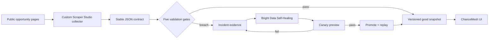

# ScrapeGuard

[](https://github.com/mindofyaseen/scrapeguard/actions/workflows/ci.yml)

> The web changes. Your data contract should not.

ScrapeGuard is a reliability layer for custom Bright Data Scraper Studio collectors. It detects silent extraction failures, preserves the last-known-good dataset, sends evidence to the Self-Healing workflow, and promotes a repair only after deterministic canary checks pass. ChanceMesh is the downstream opportunity feed that proves the recovered structured data remains useful.

Built during **WeMakeDevs × Bright Data: Into the Scrape-Verse**, 17–23 August 2026.

**Live demo:** https://scrapeguard-eight.vercel.app

## Why it matters

A scraper can still exit successfully while returning incomplete or semantically wrong data. ScrapeGuard treats the output schema as a contract:

1. A custom Scraper Studio collector extracts public opportunities.
2. Five deterministic gates score schema, critical completeness, semantics, volume and freshness.
3. A failed run opens an incident and continues serving the last-known-good snapshot.
4. Bright Data Self-Healing receives a narrow, evidence-bound repair prompt.
5. The candidate runs on canary inputs; only a passing candidate is promoted.
6. Failed inputs replay through the same stable Collector ID.

The `/lab` route is a deterministic public failure fixture. Layout A exposes `.opportunity-card .deadline`; Layout B moves the same value to `[data-field="closing-date"]`, reproducing a realistic selector regression without depending on a third party to redesign a page during the demo.

## Product tour

- **Command center** — weighted health contract and coding-agent terminal evidence.
- **3D contract core** — dependency-free, state-aware schema/volume/freshness visualization with pointer parallax and reduced-motion support.
- **ChanceMesh feed** — searchable, filterable downstream product powered by the stable schema.
- **Repair evidence** — before/after selector diff, bounded repair prompt and canary promotion gates.
- **Public fixture** — `/lab?layout=classic` and `/lab?layout=shifted` create a repeatable break/fix story.
- **Visual failure lab** — full Layout A/B mockups, the real `4 → 0 → 4` recovery rail and rejected-candidate story.
- **Judge-ready narrative** — verification receipt, system architecture and dedicated proof for all three prize tracks.

## Stack

- Next.js 16, React 19 and TypeScript
- Zod for the stable output contract
- Vitest for deterministic validation tests
- Bright Data Scraper Studio, CLI and Self-Healing workflow
- Plain CSS with responsive and reduced-motion support

## Run locally

Requirements: Node.js 20+ and pnpm 11+.

```bash
pnpm install
pnpm dev
```

Open `http://localhost:3000`. Use **Simulate layout change**, inspect the incident, and run the repair demo. The same flow is available on the [public deployment](https://scrapeguard-eight.vercel.app).

For a server-side Bright Data run, copy `.env.example` to `.env.local` and set:

```dotenv
BRIGHT_DATA_API_TOKEN=your_server_only_token
BRIGHT_DATA_COLLECTOR_ID=c_your_collector
SCRAPEGUARD_FIXTURE_URL=https://your-deployment.example/lab
```

Never expose `BRIGHT_DATA_API_TOKEN` through a `NEXT_PUBLIC_` variable or commit it.

## Quality checks

```bash
pnpm test
pnpm typecheck
pnpm build
```

The validator lives in `lib/validation.ts`; its happy path, missing-critical-field failure and stale-data case are covered in `lib/validation.test.ts`.

## Architecture



More detailed diagrams and failure-state design are in [ARCHITECTURE_PLAN.md](./ARCHITECTURE_PLAN.md).

## Repository guide

- `app/` — dashboard, public fixture and server-side Bright Data route
- `components/dashboard.tsx` — interactive product state machine
- `lib/opportunity.ts` — canonical structured-output schema
- `lib/validation.ts` — deterministic promotion policy
- `examples/opportunities.sample.json` — example structured output required for judging
- `BRIGHT_DATA_LEARNING_GUIDE.md` — tool-learning path and CLI workflow
- `BRIGHT_DATA_EVIDENCE.md` — real Collector ID, failure, repair and final canary results
- `JUDGING_AND_DEMO_PLAYBOOK.md` — track strategy and three-minute demo plan
- `SUBMISSION_CHECKLIST.md` — remaining evidence and submission tasks

## AI disclosure

OpenAI Codex was used as a coding assistant for research, implementation, testing and documentation. The participant directed the project, selected the problem and architecture, reviewed the output, and is responsible for understanding and presenting every technical decision.

## Public-data and security policy

ScrapeGuard is designed for public, non-login-protected pages. It does not collect personal, paywalled, private or restricted data. Source URLs remain attached for provenance. Secrets stay server-side and logs must never contain credentials.

## Official references

- [Hackathon overview](https://www.wemakedevs.org/hackathons/scrape-verse)
- [Hackathon rules](https://www.wemakedevs.org/hackathons/scrape-verse/rules)
- [Scraper Studio documentation](https://docs.brightdata.com/scraping-automation/scraper-studio/overview)
- [Bright Data documentation index](https://docs.brightdata.com/llms.txt)

## License

MIT — see `LICENSE`.
