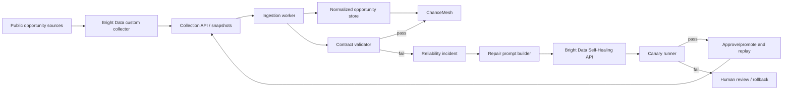

# Into the Scrape-Verse — Winning Blueprint

Status: pre-hackathon planning only  
Planning date: 8 August 2026  
Build window: 17–23 August 2026

## 1. Decision

Build **ScrapeGuard**: an autonomous reliability layer for Bright Data Scraper Studio collectors, demonstrated through a polished working experience called **ChanceMesh** that monitors public grants, scholarships, hackathons, and developer programs.

The product does not merely scrape pages. It defines a stable data contract, detects silent extraction failures, asks Bright Data Self-Healing to repair the collector, validates the proposed repair on canary pages, and replays failed inputs before downstream users see a gap.

One-line pitch:

> ScrapeGuard keeps public opportunity data trustworthy when the web changes underneath it.

## 2. Why this is the strongest first-prize direction

The grand prize is Best Use of Bright Data. A generic dashboard or price tracker makes Bright Data replaceable. ScrapeGuard makes the platform's custom collectors, coding-agent workflow, structured outputs, and Self-Healing capability the core product loop.

ChanceMesh gives the reliability engine a concrete human outcome: students, developers, and small teams should not miss an opportunity because a source changed its HTML.

This provides four things judges can remember:

1. A clear problem with real consequences.
2. A visible and technically credible self-healing loop.
3. A useful final product powered by the recovered structured data.
4. A deterministic demo in which a scraper breaks and repairs itself.

## 3. Product scope

### Must ship

- One custom Bright Data Scraper Studio collector created and operated from Codex through the Bright Data CLI.
- At least two public source layouts feeding one normalized opportunity schema.
- A controlled public fixture site with version A and version B layouts for a guaranteed live break/heal demo.
- Collection runs with snapshot IDs and persisted structured results.
- Data-contract checks for required fields, types, completeness, uniqueness, URL validity, deadlines, and suspicious distribution changes.
- Incident creation when a run breaches its contract.
- Bright Data Self-Healing trigger with a precise, field-level prompt.
- Repair progress polling and a visible audit trail.
- Canary validation before promotion/re-run.
- Replay of failed inputs after a successful repair.
- Opportunity feed with filters, search, deadlines, source links, and freshness indicators.
- A 2–3 minute rehearsed demo, public repository, clear README, architecture diagram, sample JSON, tests, and AI-use disclosure.

### Strong stretch goals

- Side-by-side HTML/output diff for the broken and repaired versions.
- Human approval mode and automatic mode.
- Webhook or scheduled collection.
- Geographic/time-zone normalization.
- Notification digest for saved interests.
- Cost/page-load telemetry.
- WARC/snapshot evidence where supported.

### Explicitly out of scope

- A universal crawler for arbitrary sites.
- More than 2–3 production sources.
- Scraping login-protected, paywalled, personal, or restricted data.
- Training a custom model.
- Complex multi-tenant billing or enterprise RBAC.
- Mobile applications.

## 4. User journey

1. User opens ChanceMesh and sees fresh, normalized public opportunities.
2. An operator opens the Reliability view and sees every source as Healthy.
3. A scheduled or manual Bright Data collection runs.
4. A source layout changes and critical fields become null or semantically invalid.
5. ScrapeGuard creates an incident and explains exactly which contract failed.
6. It generates a repair prompt containing affected fields, observed evidence, expected schema, and a representative URL.
7. Bright Data Self-Healing proposes a collector refactor.
8. ScrapeGuard tests the repaired collector on canary inputs.
9. If validation improves without schema regression, the repair is approved/promoted and failed inputs are replayed.
10. The feed stays on the same stable schema and the incident timeline records the recovery.

## 5. Winning demo script

Target length: 2 minutes 30 seconds, with a 90-second fallback cut.

### Act 1 — Stakes (0:00–0:20)

Show an opportunity with a near deadline. Explain that silent scraper failure can make useful public information disappear even though the source is still online.

### Act 2 — Healthy system (0:20–0:45)

Run the custom collector from Codex. Show the Collector ID, Bright Data run, structured JSON, and the same records appearing in the product.

### Act 3 — Controlled break (0:45–1:10)

Switch the fixture site from layout A to layout B. Run the unchanged collector. Show missing funding/deadline fields and the contract score dropping.

### Act 4 — Repair (1:10–1:55)

Show incident creation, the exact Self-Healing prompt, Bright Data refactor progress, and the generated change. Run canaries and display old-versus-new validation scores.

### Act 5 — Recovery and value (1:55–2:20)

Replay the failed inputs. Show the same stable downstream schema, restored feed, recovery time, and full audit trail.

### Act 6 — Close (2:20–2:30)

> Websites change. The data contract should not. ScrapeGuard makes Bright Data collectors repairable, testable, and safe to trust.

Record a clean backup demo. Do not depend on live AI-generation latency during judging; refactoring can take several minutes. The live app may show a sped-up recorded incident while a real completed run and Collector ID remain inspectable.

## 6. Architecture



## 7. Proposed implementation stack

- Web application: Next.js + TypeScript.
- UI: Tailwind CSS plus an accessible component system.
- Database: PostgreSQL with Drizzle ORM, or SQLite for the demo if external deployment time becomes risky.
- Background work: simple database-backed jobs; avoid adding a queue service unless load proves it necessary.
- Validation: Zod for structural contracts plus custom semantic and statistical checks.
- Charts: lightweight SVG/Recharts for completeness and incident timelines.
- Tests: Vitest for unit/contract tests and Playwright for the critical demo journey.
- Deployment: Vercel for the web application and a small worker/runtime only if background execution cannot fit serverless limits.
- Scraping: Bright Data Scraper Studio custom collector, CLI, Collection API, and AI Flow/Self-Healing API.

The architecture should stay boring outside the sponsor integration. Reliability and demo confidence matter more than adding infrastructure brands.

## 8. Core data contract

```json
{
  "source": "string",
  "source_url": "https://...",
  "title": "string",
  "provider": "string|null",
  "summary": "string|null",
  "opportunity_type": "grant|scholarship|hackathon|program|other",
  "amount_text": "string|null",
  "deadline": "ISO-8601|null",
  "eligibility": ["string"],
  "location": "string|null",
  "remote": true,
  "tags": ["string"],
  "collected_at": "ISO-8601",
  "collector_id": "c_...",
  "snapshot_id": "string",
  "content_fingerprint": "string"
}
```

Every record must retain source provenance. No generated field may be presented as source fact without a clear derived label.

## 9. Reliability model

Calculate a health score from deterministic checks:

- Schema validity: 25%
- Required-field completeness: 25%
- Semantic validity: 20%
- Record-count/distribution drift: 15%
- Freshness: 10%
- Duplicate rate: 5%

Initial repair trigger:

- any critical field completeness below 80%; or
- health score below 75; or
- more than 30% drop from the previous successful baseline; or
- explicit collector/runtime failure.

Guardrails:

- Never auto-approve a repair that reduces the record count or any critical-field score beyond tolerance.
- Require at least two canary inputs where possible.
- Preserve the last known good collector/version and dataset.
- Limit automated repair attempts to prevent loops and cost spikes.
- Redact API keys and tokens from logs.
- Show uncertainty; do not silently invent missing values.

## 10. Bright Data integration proof

The repository and demo must visibly prove:

- `bdata login`, `bdata scraper create`, and `bdata scraper run` were driven through Codex.
- The stable `c_*` Collector ID is stored in configuration, never hard-coded with secrets.
- The custom scraper's interaction code, parser logic, schemas, and stages are documented.
- Collection uses real Bright Data snapshot/job identifiers.
- Self-Healing uses the documented refactor flow and progress endpoint.
- Bright Data output directly feeds the application database and UI.
- Before/after evidence shows a genuine extraction regression and genuine repaired output.

Do not claim that the coding agent itself wrote the Bright Data scraper: the CLI invokes Bright Data's AI Agent; Codex orchestrates the CLI and application work.

## 11. Seven-day build plan

### Day 1 — Foundation and Bright Data proof

- Create public repository after the event starts.
- Record start time and first commits for eligibility evidence.
- Authenticate CLI and create the custom collector from Codex.
- Validate one real source and the controlled fixture.
- Freeze input/output schemas and save example JSON.
- Scaffold app, database, CI, linting, and tests.

Exit criterion: a real Collector ID produces valid structured records from Codex.

### Day 2 — Product value

- Build ingestion and normalization.
- Build ChanceMesh feed, filters, detail view, provenance, and freshness.
- Add fixture site layouts A and B.

Exit criterion: collector output powers a useful polished screen.

### Day 3 — Detection

- Implement contract validation, baselines, health score, and incidents.
- Add unit tests for null fields, wrong types, duplicates, drift, and dead pages.
- Demonstrate deterministic failure on layout B.

Exit criterion: failures are detected correctly without an LLM judgment.

### Day 4 — Healing loop

- Integrate Self-Healing trigger/progress.
- Build field-specific repair prompts.
- Implement canary comparison and approval state machine.
- Add replay of failed inputs.

Exit criterion: one complete break-to-recovery run is captured.

### Day 5 — Reliability and clean code

- Handle API timeouts, retries/backoff, partial jobs, duplicate callbacks, and secrets.
- Add last-known-good fallback and repair-attempt limits.
- Complete integration/e2e tests and structured logs.
- Refactor modules and document important decisions.

Exit criterion: rehearsed demo succeeds three consecutive times.

### Day 6 — UI and storytelling

- Finish responsive UI, empty/loading/error states, accessibility, and micro-interactions.
- Build incident timeline and before/after evidence view.
- Prepare architecture diagram, screenshots, sample output, and README.
- Record first full demo draft.

Exit criterion: a stranger can understand and run the project from the README.

### Day 7 — Submission buffer

- Fix only high-impact issues.
- Run full tests and secret scan.
- Record final demo and backup cut.
- Verify public repo, deployment, sample data, AI disclosure, and submission fields.
- Submit early; do not use the final hours for new features.

## 12. Rubric evidence matrix

| Criterion | Evidence judges will see |
|---|---|
| Potential impact | Near-deadline opportunities remain discoverable despite source changes |
| Creativity | Contract-driven autonomous repair and safe replay, not merely extraction |
| Technical excellence | Typed schemas, state machine, canaries, last-known-good fallback, tests |
| Use of Scraper Studio | Custom collector, CLI from Codex, Collection API, Self-Healing API |
| Reliability/self-healing | Deterministic layout break with measured detection and recovery |
| Presentation | Tight story, live evidence, polished product, concise README/video |

## 13. README structure

1. One-sentence value proposition and 15-second GIF.
2. Problem and affected user.
3. Live demo and video links.
4. The break/heal/recover sequence.
5. Why Bright Data Scraper Studio is indispensable.
6. Architecture diagram.
7. Custom scraper input/output schemas and sample record.
8. Local setup with safe environment-variable examples.
9. Test instructions.
10. Reliability guarantees and known limitations.
11. Public-data/compliance statement.
12. AI tools disclosure and participant-owned technical decisions.
13. Work completed during the hackathon.

## 14. Submission checklist

- Every team member registered and only on one team.
- Main code/design work begins on or after 17 August 2026.
- Custom Scraper Studio scraper is included and explained.
- Only publicly available, non-personal, non-paywalled data is collected.
- Public source repository and visible hackathon-period history.
- Clear README and setup instructions.
- Example structured output committed with sensitive values removed.
- Working deployed demo.
- Demo video shows problem, collector workflow, break, healing, output, and product.
- AI assistant usage disclosed.
- API tokens excluded from code, logs, screenshots, commits, and video.
- Licenses/attributions included.
- Each teammate can explain the architecture and decisions.

## 15. Pre-event tasks allowed now

- Register every team member.
- Confirm exact submission deadline, timezone, video-length limit, platform, schedule, and support channel once published.
- Create private planning notes and diagrams only.
- Decide roles and daily availability.
- Select candidate public sources and check their terms/robots/accessibility manually.
- Prepare accounts, but do not create the competition collector or product code before the start.
- Prepare a demo narration outline and risk register.

## 16. Decision gates

- If programmatic Self-Healing approval cannot be completed safely, use a human approval step while keeping detection, prompt generation, progress, validation, and replay automated.
- If a real source blocks reliable demonstration, retain it as supplemental evidence and use the controlled public fixture for the live break.
- If background jobs complicate deployment, use an operator-triggered run with persisted state; do not sacrifice demo reliability.
- If time slips, cut notifications, multi-tenancy, and extra sources before cutting canary validation, the opportunity feed, tests, or the demo story.

## 17. Official references

- Hackathon: https://www.wemakedevs.org/hackathons/scrape-verse
- Rules: https://www.wemakedevs.org/hackathons/scrape-verse/rules
- Bright Data Scraper Studio: https://brightdata.com/products/web-scraper/studio
- Scraper Studio introduction: https://docs.brightdata.com/datasets/scraper-studio/introduction
- CLI: https://docs.brightdata.com/datasets/scraper-studio/build-with-the-cli
- Coding-agent prompts: https://docs.brightdata.com/datasets/scraper-studio/coding-agent-prompts
- IDE basics: https://docs.brightdata.com/datasets/scraper-studio/basics-of-web-scraping
- Self-Healing: https://docs.brightdata.com/datasets/scraper-studio/self-healing-tool
- Collection API: https://docs.brightdata.com/datasets/scraper-studio/quickstart
- AI Flow API: https://docs.brightdata.com/api-reference/scraper-studio-api/ai-flow/overview
- Best practices: https://docs.brightdata.com/datasets/scraper-studio/best-practices
